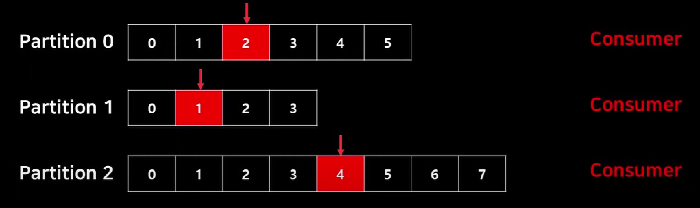

## Apache Kafka 와 Slack 연동하여 메시지 보내는 실습을 진행해보겠다.

* 브로커 , 프로듀서 , 컨슈머 , 주키퍼 , 

카프카는 클러스터 , 프로듀서와 컨슈머로 크게 3가지로 나뉘어진다. 
프로듀서는 생산자로 볼 수 있겠다. 
컨슈머는 파티션에서 토픽에서 데이터를 읽어오는 역할을 한다. 

브로커는 데이터의 저장을 전달을 담당하며 
프로듀서가 생성한 토픽을 파티션에 저장한다. 

주키퍼는 카프카 클러스터의 구성정보와 설정을 관리하는 관리자 역할을 한다.

프로듀서가 처리해야되는 이벤트를 넣어주면 컨슈머가 처리하게 된다.

카프카 클러스터는 처리해야될 일을 토픽 단위로 갖고 있다.

해당 페이지에서 메시지를 입력하여 보내면 카프카로 메시지가 날아간다.

오른쪽 하단에 보면 슬랙 메시지가 날아온 것을 알 수 있다.

이번 프로젝트를 해보면서 카프카를 처음 써보게 됐는데, 
많은 것을 배울 수 있었다. 

카프카를 쓰는 이유는 넷상에서 이벤트가 발생할 때 , 연결이 끊어지게 되면 
진행하고 있던 작업들이 모두 중단되어 버리는데 , 

카프카를 통해서 이벤트들을 저장소에 저장하고 있다가 , 연결이 끊어지더라도
다시 실행했을때 파티션에 저장되어 있는 토픽들을 순차적으로 처리할 수 있기 때문에 
사용한다. 